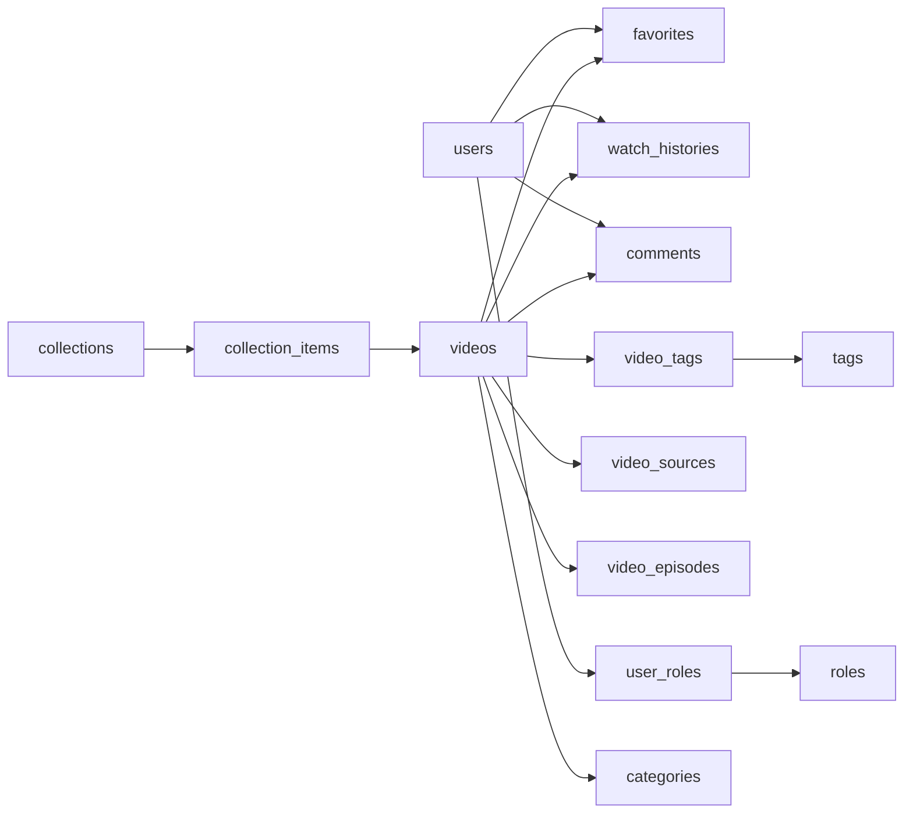

# 视频网站 CMS 方案

## 1. 产品 PRD

### 1.1 项目定位

打造一个支持前台展示、视频播放、内容运营和后台管理的一体化视频网站。系统以 CMS 为核心，支持内容采集、上传、审核、发布、推荐、统计与用户运营，适合做影视站、短视频站、教育视频站、会员视频站等。

### 1.2 产品目标

- 提供完整的视频内容发布与管理能力
- 提供适配移动端和桌面端的前台观看体验
- 提供可运营的后台 CMS，让编辑和运营可独立工作
- 支持后续扩展会员、广告、专题、支付、推荐系统

### 1.3 用户角色

- 游客：浏览、搜索、观看部分公开内容
- 注册用户：收藏、评论、查看历史、订阅
- 会员用户：观看会员内容、高清内容、无广告内容
- 编辑/运营：管理视频、专题、推荐位、评论
- 审核员：审核内容和用户评论
- 超级管理员：管理权限、系统配置、广告、日志

### 1.4 前台功能清单

#### 首页

- 顶部导航
- 频道入口
- Banner 轮播
- 热门推荐
- 最新上新
- 分类分区
- 专题合集
- 榜单模块
- 底部站点信息与友情链接

#### 分类页

- 一级频道展示
- 多维筛选：分类、地区、年份、语言、题材
- 排序：最新、最热、评分、播放量
- 列表分页或无限滚动

#### 搜索页

- 关键词搜索
- 热搜词
- 联想提示
- 搜索历史
- 搜索结果筛选

#### 视频详情页

- 视频标题、海报、简介
- 播放器
- 清晰度切换
- 集数切换
- 字幕切换
- 标签与分类
- 演员/导演信息
- 相关推荐
- 点赞、收藏、分享
- 评论区

#### 用户系统

- 注册 / 登录 / 找回密码
- 第三方登录预留
- 个人资料
- 观看历史
- 收藏夹
- 我的评论
- 我的订阅
- 会员中心

#### 专题与运营页面

- 专题页
- 榜单页
- 活动页
- 作者/UP主页

### 1.5 后台 CMS 功能清单

#### 仪表盘

- 视频总数
- 播放总量
- 用户增长
- 待审核数量
- 热门内容排行

#### 内容管理

- 视频新增、编辑、删除、上下架
- 多视频源管理
- 多集管理
- 封面、海报、预告片管理
- 字幕管理
- 批量导入与批量操作

#### 分类与标签管理

- 频道管理
- 子分类管理
- 标签管理
- 地区/年份/语言维度管理

#### 专题与推荐位管理

- Banner 管理
- 首页推荐位管理
- 榜单管理
- 专题合集管理
- 手动置顶与排序

#### 用户与互动管理

- 用户列表
- 会员状态管理
- 封禁与黑名单
- 评论审核
- 敏感词过滤

#### 广告与商业化

- Banner 广告
- 播放前贴片广告
- 暂停广告
- 会员免广告策略

#### 数据统计

- 视频播放量
- 完播率
- 用户留存
- 热门关键词
- 来源渠道
- 内容表现排行

#### 系统配置

- 站点基础设置
- SEO 设置
- 存储设置
- 转码设置
- 播放器设置
- 权限角色设置
- 操作日志

### 1.6 核心业务流程

1. 运营上传视频或录入视频源
2. 系统保存封面、剧照、字幕、分类和标签
3. 转码服务生成多清晰度资源
4. 审核员审核视频内容
5. 审核通过后上架发布
6. 运营设置推荐位或加入专题
7. 用户在前台浏览、搜索、观看、评论、收藏
8. 后台统计播放与互动数据

### 1.7 非功能需求

- 支持 SEO
- 支持移动端响应式
- 支持 CDN / 对象存储
- 支持权限控制和操作日志
- 支持缓存与高并发读场景
- 支持后续接入会员、支付、推荐算法

### 1.8 MVP 范围

#### 第一阶段必须做

- 前台：首页、分类页、搜索页、详情页、登录注册、用户中心
- 后台：视频管理、分类管理、标签管理、推荐位管理、评论审核、用户管理
- 基础能力：上传封面、录入视频地址、播放器、SEO、权限

#### 第二阶段扩展

- 多清晰度转码
- 会员系统
- 广告系统
- 专题页
- 数据报表
- 收藏和历史

#### 第三阶段扩展

- 支付
- 自动推荐
- 弹幕
- 多作者投稿
- AI 标签和摘要

## 2. 数据库表结构设计

### 2.1 核心表

#### users

- id
- email
- phone
- password_hash
- nickname
- avatar
- bio
- status
- member_level
- member_expired_at
- created_at
- updated_at

#### roles

- id
- name
- code
- description
- created_at

#### user_roles

- id
- user_id
- role_id

#### videos

- id
- title
- slug
- subtitle
- description
- cover_url
- poster_url
- trailer_url
- type
- category_id
- region
- language
- year
- duration_seconds
- status
- audit_status
- published_at
- view_count
- like_count
- favorite_count
- comment_count
- created_by
- created_at
- updated_at

#### video_sources

- id
- video_id
- source_type
- source_url
- storage_path
- cdn_url
- resolution
- bitrate
- format
- sort_order
- created_at

#### video_episodes

- id
- video_id
- title
- episode_no
- source_id
- duration_seconds
- is_free
- published_at
- sort_order

#### video_subtitles

- id
- video_id
- episode_id
- language
- file_url
- format

#### categories

- id
- parent_id
- name
- slug
- description
- sort_order
- status

#### tags

- id
- name
- slug
- color

#### video_tags

- id
- video_id
- tag_id

#### collections

- id
- title
- slug
- description
- cover_url
- type
- status
- sort_order
- created_at

#### collection_items

- id
- collection_id
- video_id
- sort_order

#### banners

- id
- title
- image_url
- target_url
- video_id
- sort_order
- start_at
- end_at
- status

#### comments

- id
- video_id
- user_id
- parent_id
- content
- status
- like_count
- created_at

#### favorites

- id
- user_id
- video_id
- created_at

#### watch_histories

- id
- user_id
- video_id
- episode_id
- progress_seconds
- watched_at

#### searches

- id
- user_id
- keyword
- created_at

#### ads

- id
- name
- type
- image_url
- video_url
- target_url
- placement
- start_at
- end_at
- status

#### pages

- id
- title
- slug
- content
- seo_title
- seo_description
- status

#### system_settings

- id
- setting_key
- setting_value
- updated_at

#### audit_logs

- id
- user_id
- action
- module
- target_id
- detail
- created_at

### 2.2 关系说明

- `users` 对 `roles` 是多对多
- `videos` 对 `categories` 是多对一
- `videos` 对 `tags` 是多对多
- `videos` 对 `video_sources` 是一对多
- `videos` 对 `video_episodes` 是一对多
- `videos` 对 `comments` 是一对多
- `users` 对 `comments`、`favorites`、`watch_histories` 是一对多
- `collections` 对 `videos` 是多对多

### 2.3 建表建议

- 所有主键使用 UUID 或 bigint
- 高频查询字段加索引：`slug`、`status`、`published_at`、`category_id`
- 搜索相关字段可先做普通索引，后续接入全文搜索
- 评论、历史、日志类表做好分页索引

### 2.4 简化 ER 思路

## 3. 前后台页面原型清单

### 3.1 前台页面

#### 公共页面

- 首页
- 分类页
- 搜索结果页
- 视频详情页
- 专题页
- 榜单页
- 404 页面

#### 用户页面

- 登录页
- 注册页
- 忘记密码页
- 用户中心首页
- 个人资料页
- 我的收藏页
- 观看历史页
- 我的评论页
- 我的订阅页
- 会员中心页

#### 内容扩展页面

- 作者主页
- 活动专题页
- 静态单页：关于我们、版权声明、隐私政策

### 3.2 后台页面

#### 仪表盘

- 数据总览
- 趋势图表
- 待办提醒

#### 内容中心

- 视频列表页
- 新增视频页
- 编辑视频页
- 多集管理页
- 视频源管理页
- 字幕管理页

#### 分类与标签

- 分类列表页
- 标签列表页

#### 运营中心

- Banner 管理页
- 推荐位管理页
- 专题管理页
- 榜单管理页
- 广告管理页

#### 用户与互动

- 用户列表页
- 用户详情页
- 评论审核页
- 黑名单管理页

#### 数据中心

- 播放统计页
- 用户统计页
- 搜索统计页
- 内容表现页

#### 系统中心

- 角色权限页
- 管理员账号页
- 系统设置页
- SEO 设置页
- 存储配置页
- 播放器配置页
- 操作日志页

### 3.3 后台导航建议

1. 仪表盘
2. 视频管理
3. 分类标签
4. 专题推荐
5. 评论用户
6. 广告商业化
7. 数据统计
8. 系统设置

## 4. 推荐技术栈

- 前台：Next.js
- 后台：Next.js Admin 或 React Admin
- 服务端：Next.js API 或 NestJS
- 数据库：PostgreSQL
- ORM：Prisma
- 鉴权：NextAuth 或 JWT
- 缓存：Redis
- 文件存储：OSS / S3
- 视频处理：FFmpeg + 队列服务

## 5. 下一步建议

1. 先确认是做影视点播站、短视频站还是教育视频站
2. 我可以继续帮你输出 Prisma 数据模型
3. 我可以继续帮你输出前后台低保真页面结构
4. 我也可以直接在当前目录搭建一个 `Next.js + Prisma + CMS Admin` 的项目骨架
